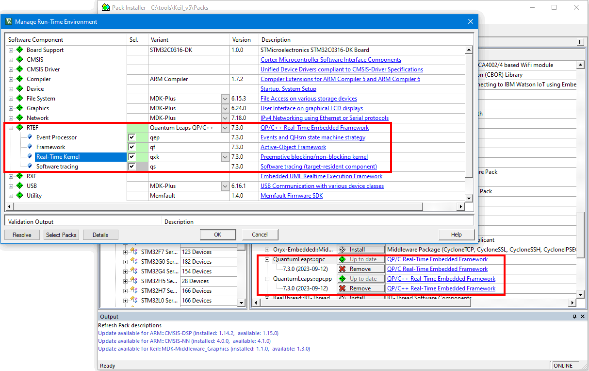
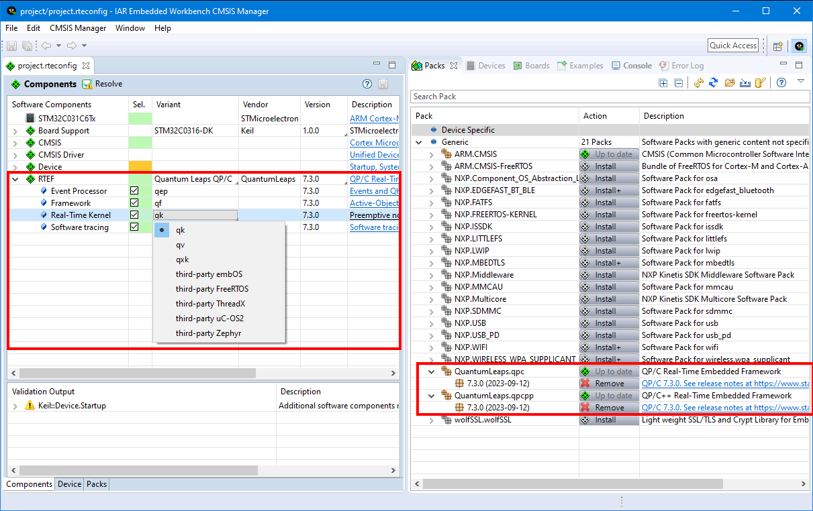
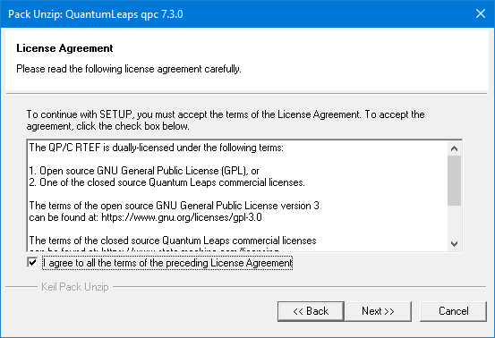

## Brought to you by:

---------------------------------------------------------------------
# About This Repository
This repository contains the index ([QuantumLeaps.pidx](QuantumLeaps.pidx)) and the descriptions of the following [CMSIS Softwre Packs](https://open-cmsis-pack.github.io/Open-CMSIS-Pack-Spec/main/html):

- [QuantumLeaps.qpc.pdsc](QuantumLeaps.qpc.pdsc) decribes the [QP/C RTEF](https://github.com/QuantumLeaps/qpc) (Real-Time Embedded Framework). All released versions of this pack are named `QuantumLeaps.qpc.<version>.pack` and are located in the [<strong>qpc Releases</strong>](https://github.com/QuantumLeaps/qpc/releases).

- [QuantumLeaps.qpcpp.pdsc](QuantumLeaps.qpcpp.pdsc) decribes the [QP/C++ RTEF](https://github.com/QuantumLeaps/qpcpp) (Real-Time Embedded Framework). All released versions of this pack are named `QuantumLeaps.qpcpp.<version>.pack` and are located in the [<strong>qpcpp Releases</strong>](https://github.com/QuantumLeaps/qpcpp/releases).

# Installation
The QuantumLeaps packs can be installed through the [ARM/KEIL CMSIS Pack Server](https://www.keil.arm.com/packs). Alternatively the packs can be downloaded directly from QuantumLeaps GitHub repositories and then installed locally by means of utilities like [cpackget](https://github.com/Open-CMSIS-Pack/cpackget).

After installation, QuantumLeaps packs appear as the **RTEF** Software Component. The screen shots below show how the QuantumLeaps packs look in the KEIL MDK and IAR EWARM.

 
<em>QuantumLeaps packs installed and used in KEIL MDK</em>

 
<em>QuantumLeaps packs installed and used in IAR EWARM</em>

# Licensing
The QuantumLeaps packs are licensed under the dual-licensing model described in the fille [License.txt](License.txt), which you also need to accept when installing the packs.

 
<em>License agreement displayed during pack installation.</em>

# How to Help this Project?
If you like this project, please give this GitHub repository a star (in the upper-right corner of your browser window):

